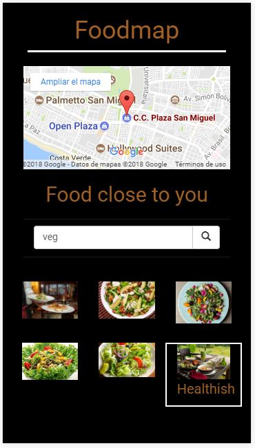
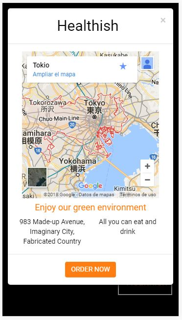

# Foodmap

* **Track:** _Common Core_
* **Curso:** _Crea tu propia red social_
* **Unidad:** _Agiliza tu desarrollo_

***
### Se puede acceder a este proyecto en [Github](https://lizbethfp.github.io// "Github")
***

## Objetivo
---
El reto consiste en realizar una aplicación móvil con la ayuda del framework Bootstrap y la librería de Javascript Jquery. Dicha aplicación debe inicializar con una animación del nombre. Luego, debe permitir realizar una búsqueda de restaurante por el tipo de comida (comida vegetariana y parrillas). Según la elección, se mostrará 5 opciones de restaurantes para visitar según la ubicación. Al pasar el mouse sobre una de las imágenes, se activará un efecto y al seleccionar un restaurante, se abrirá una ventana emergente con su información. Al cerrar la ventana emergente, se regresará a la vista principal. La aplicación deberá verse así para cada una de sus fases:

#### Aplicación con animación

#### Búsqueda de restaurante según tipo de comida
(comida vegetariana y parrillas)

### Mostrar restaurantes que cumplan con lo escogido en la búsqueda

#### Efecto al pasar el mouse sobre imagen

#### Ventana emergente al seleccionar una restaurante

#### Regresar a vista principal cerrar la ventana emergente

## Autora
Lizbeth Félix Peña

## Fecha
24/12/2017
